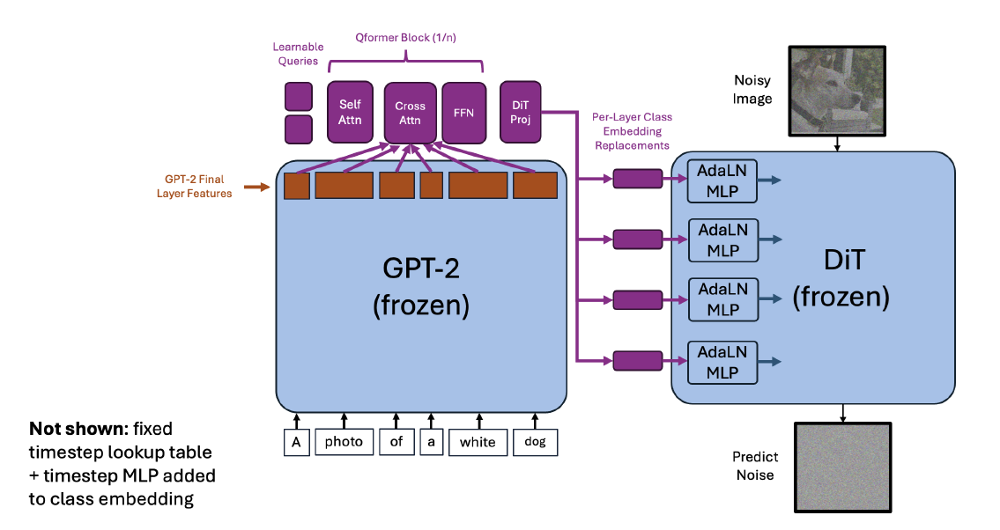
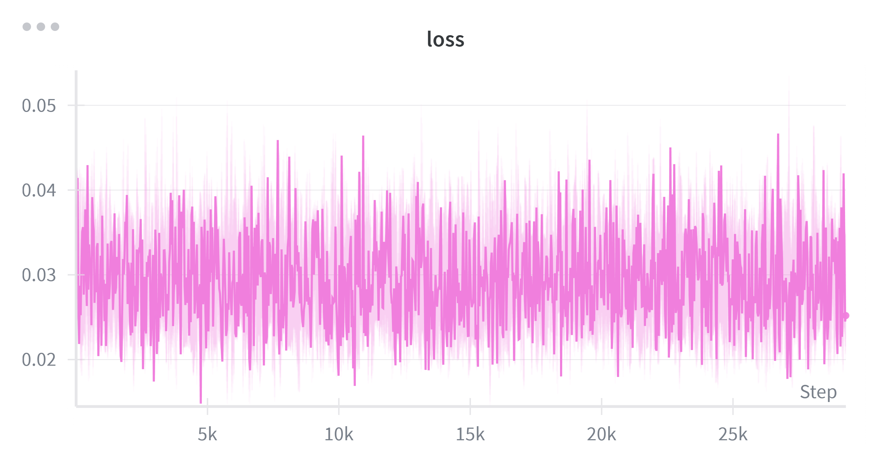
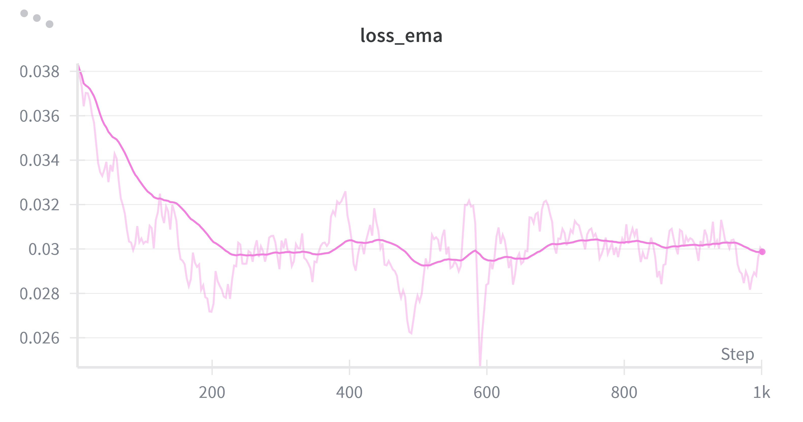
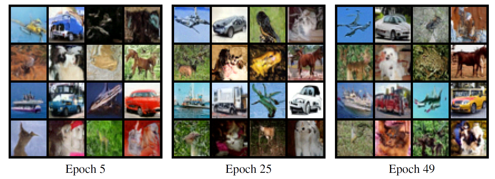
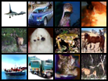
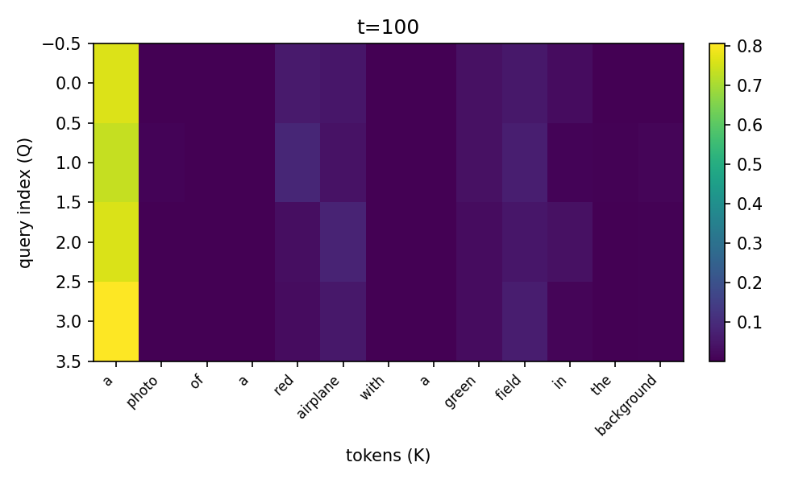
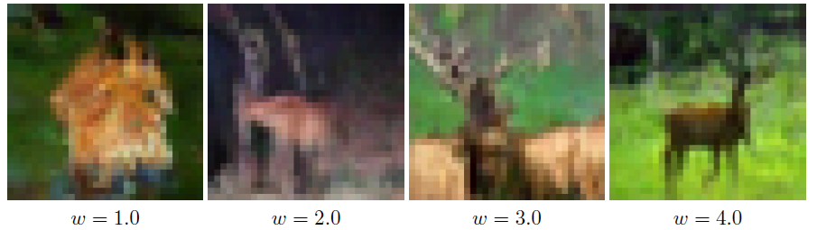
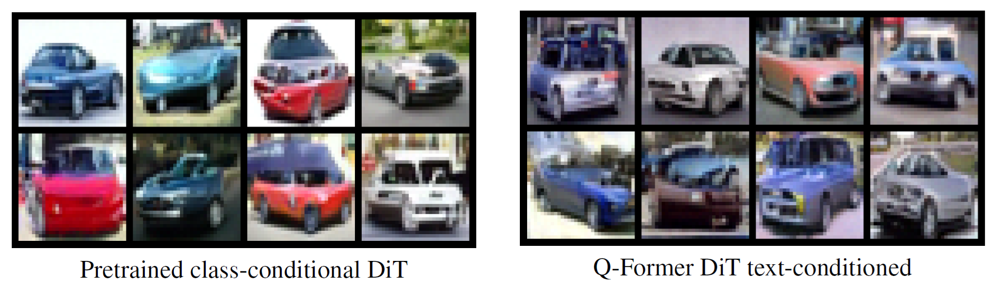
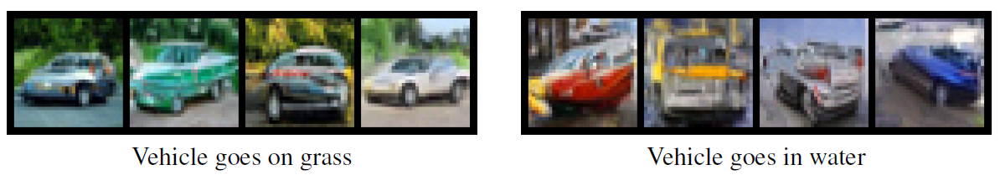
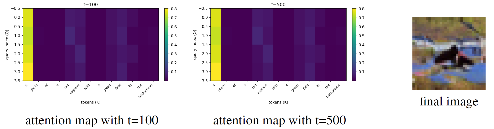

# LLM2DiT: Bridging GPT-2 and Diffusion Transformers via Q-Former

This repo implements **LLM2DiT**, a small-scale research project that bridges an autoregressive language model (**GPT‑2**) and a diffusion transformer (**DiT**) through a lightweight **Q‑Former** (QueryEmbedder). The model is trained and evaluated on **CIFAR‑10**, with:

- A pretrained **DiT** DDPM model on CIFAR‑10 images.
- A **GPT‑2** encoder that produces dense token-level hidden states for captions.
- A **Q‑Former** that maps GPT‑2 hidden states to **per‑layer conditioning vectors** for DiT via AdaLN.
- Visualization tools for **cross‑attention heatmaps** and generated samples.

The goal is to prototype and analyze how text representations from a causal LM can be injected into a diffusion transformer via a learned query module.

## Model Architecture
<p align="center">
  
</p>

<p align="center"><em>Figure 1. Q-Former Architecture Bridging GPT-2 and DiT for Text-to-Image Generation.</em></p>


---

## Repository structure

```text
LLM2DiT/
├─ README.md
├─ requirements.txt
│
├─ configs/
│  ├─ inference_class_vs_textpromp.yaml       # Class‑conditioned generation (label only) and text-prompts-conditioned generation.
│  ├─ inference_ood.yaml                      # Text‑conditioned generation (GPT‑2 + Q‑Former) comparison between regular case and OOD (Out-Of-Distribution) case.
│  ├─ inference_cfgsweep.yaml                 # Text‑conditioned generation (GPT‑2 + Q‑Former) comparison between different setting of Classifier-Free-Guidance (CFG).
│  └─ inference_attn.yaml                     # Text‑conditioned generation + attention visuzliation
│
├─ src/
│  ├─ __init__.py
│  ├─ train_qformer.py             # Train Q‑Former on CIFAR‑10 + dense captions
│  ├─ eval_qformer.py              # Run sampling from DiT (+ optional attention viz)
│  ├─ image_caption_data.py        # CIFAR‑10 + captions + GPT‑2 text embedding cache
│  │
│  ├─ models/
│  │  ├─ __init__.py
│  │  └─ dit.py                    # DiT_Llama, QueryEmbedder (Q‑Former), attention blocks
│  │
│  ├─ diffusion/
│  │  ├─ __init__.py
│  │  └─ ddpm.py                   # DDPM schedules and simple wrapper (training baseline)
│  │
│  └─ viz/
│     ├─ __init__.py
│     └─ attention_visualization.py  # Capture + plot Q‑Former cross‑attention
│
├─ data/
│  ├─ cifar10/cifar-10-batches-py  # CIFAR‑10 images (downloaded by torchvision)
│  ├─ cifar10_dense_captions.jsonl # Dense captions per CIFAR‑10 image (external). Can be downloaded from provided link as below.
│  ├─ text_embeddings.pt           # GPT‑2 hidden‑state cache (generated automatically). Can be downloaded from provided link as below.
│  └─ models--gpt2/                # HuggingFace GPT‑2 cache
│
├─ experiments/
│  ├─ qformer_dense/
│  │  ├─ checkpoints/                  # Trained Q‑Former + DiT weights
│  │  ├─ samples/                      # Sample grids during training
│  │  └─ logs/                         # (Optional) extra logs, if needed
│  └─ attn_maps/                       # Saved Q‑Former cross‑attention heatmaps
│  └─ base_dit/                        
│     └─ ddpm_dit_cifar_100_epochs.pth # Pre-Trained DiT weights. Can be downloaded from provided link as below.
│
├─ notebooks/
│  └─ run_in_cloud.ipynb           # Cloud / Colab / VM entry point
│
└─ tests/
   └─ test_all.py                  # Unit tests for key components (optional)
```

You can download the following files before starting running this project:

*   Cached GPT-2 text embeddings (text_embeddings.pt): https://drive.google.com/file/d/1-PcytFtt5H6D0iC2zOkIqYcESqFL3UK8/view?usp=sharing 
*   Pretrained DiT weights (ddpm_dit_cifar_100_epochs.pth): https://drive.google.com/file/d/1w_MvTxs3sdnPwNfN13OfhPi8zQE5swpj/view?usp=sharing
*   Dense CIFAR text captions (cifar10_dense_captions.jsonl): https://drive.google.com/file/d/1VC82NzZU7jRASiuOvBDoPkQfHAta1sE0/view?usp=sharing

---

## Installation

1. **Create environment**

```bash
conda create -n llm2dit python=3.10 -y
conda activate llm2dit
```

2. **Install dependencies**

Make sure `requirements.txt` contains at least:

```text
torch
torchvision
transformers
wandb
tqdm
Pillow
pyyaml
matplotlib
numpy
```

Then install:

```bash
pip install -r requirements.txt
```

3. (Optional but recommended) Login to **Weights & Biases** if you want training curves:

```bash
wandb login
```

> `train_qformer.py` logs losses and sample grids to W&B. If you do not care about online logging, you can keep WANDB disabled at the account level and just rely on console output + saved images.

---

## Data setup

### CIFAR‑10

`train_qformer.py` uses `torchvision.datasets.CIFAR10` and will automatically download CIFAR‑10 to `--data_dir` (default: `./data/cifar10`):

```bash
data/
  cifar10/
    cifar-10-batches-py/
    ...
```

### Dense captions (`cifar10_dense_captions.jsonl`)

You need a dense caption file at:

```text
data/cifar10_dense_captions.jsonl
```

Expected format: **one JSON per line**, with at least

```json
{
  "index": 0,          // CIFAR-10 train index
  "label_index": 3,    // class id (0-9)
  "caption": "a photo of a small vehicle that drives on a road"
}
```

This file is consumed by `image_caption_data.get_text_captions`, which returns:

- `index_to_captions`: image index → list of captions
- `captions_per_class`: class id → list of captions

---

## Core components

### DiT backbone + Q‑Former (src/models/dit.py)

- `DiT_Llama`  
  A DiT‑style image diffusion transformer with:
  - Initial conv stem + patch embedding
  - Transformer blocks with timestep‑conditioned AdaLN
  - Optional label conditioning (`LabelEmbedder`) or text conditioning via Q‑Former
  - Final linear projection back to image space

- `QueryEmbedder` (Q‑Former)  
  A small transformer that:
  - Starts from a **learned query table** (`num_query_tokens`).
  - Runs **self‑attention** over the query tokens.
  - Runs **cross‑attention** from queries to GPT‑2 hidden states (with masks).
  - Projects queries into the DiT conditioning dimension and maps them to **per‑layer conditioning vectors** for all DiT blocks.

During text‑conditioned generation, DiT uses:

```text
AdaLN_input[layer] = TimestepEmbedding(t) + QFormerLayerOutput[layer]
```

instead of (timestep + label embedding).

---

### Text embeddings & dataset (src/image_caption_data.py)

- Wraps **CIFAR‑10** into `CIFARTextDataset`, which returns:
  - Image tensor `(B, 3, 32, 32)`
  - GPT‑2 hidden states `(B, S, C)` and masks `(B, S)` chosen from:
    - class-name prompts (`"a photo of a truck"`)
    - dense captions per image
    - synonym augmentation for robustness

- `cache_all_text_states(...)` precomputes, for every training image:
  - `"base"` / `"base_syn"`: class‑name prompts, w/wo synonyms
  - `"caption"` / `"caption_syn"`: dense captions, w/wo synonyms  
  Each is a 2D tensor `(S, C)` plus a boolean mask.

These are stored once into:

```text
data/text_embeddings.pt
```

and loaded lazily by `CIFARTextDataset` during Q‑Former training.

---

### Diffusion utilities (src/diffusion/ddpm.py)

- `ddpm_schedules(beta1, beta2, T)`  
  Precomputes all DDPM scalars (`sqrtab`, `sqrtmab`, `sqrt_beta_t`, etc.) used by both training and sampling.

- `DDPM`  
  A simple wrapper around an epsilon‑predicting model, mostly kept for reference; in this project, we use DiT + schedules directly rather than the wrapper class.

---

### Attention visualization (src/viz/attention_visualization.py)

This module provides:

- `enable_qformer_cross_attention_patch`  
  Patches **Q‑Former cross‑attention** modules to:
  - Recompute attention manually,
  - Save attention maps `attn` with shape `[B, H, Q, K]`,
  - Store them (with layer index + timestep) into `capture_store`.

- `setup_attention_capture(entry, model, token_labels_for_first)`  
  Reads config entry (`attn_save_dir`, `attn_timesteps`), sets up patching and metadata (e.g. token labels for the first prompt).

- `perform_attention_visualization(attn_ctrl, entry, token_labels_for_first, prompts, classes)`  
  - Filters captured attention records by timestep.
  - Saves temporary `.pt` files and calls `view_qformer_attn`.
  - `view_qformer_attn` averages over layers and heads to produce a `[Q, K]` heatmap and writes PNGs to `experiments/attn_maps/...`.

These heatmaps reveal **which text tokens each query focuses on**, and can be used to diagnose issues like **attention sink**.

---

## Training: Q‑Former on CIFAR‑10 + captions

We assume you already have a pretrained DiT checkpoint on CIFAR‑10:

```text
./experiments/base_dit/ddpm_dit_cifar_100_epochs.pth
```

This checkpoint is used as initialization; during Q‑Former training, **DiT weights are frozen** and only the query module is updated.

### Recommended command

From the repo root:

```bash
python -m src.train_qformer \
  --pretrained_model_path ./experiments/base_dit/ddpm_dit_cifar_100_epochs.pth \
  --dense_captions_path ./data/cifar10_dense_captions.jsonl \
  --data_dir ./data \
  --epochs 50 \
  --batch_size 128 \
  --lr 1e-4 \
  --weight_decay 0.01 \
  --adam_epsilon 1e-8 \
  --n_T 1000 \
  --beta1 1e-4 \
  --beta2 2e-2 \
  --device 0 \
  --save_dir ./experiments/qformer_dense \
  --save_model_path ./experiments/qformer_dense/checkpoints/ddpm_dit_cifar_qformer_dense.pth \
  --num_query_tokens 4 \
  --transformer_hidden_size 768 \
  --cfg 3.0 \
  --gpt2_layer_index 12 \
  --gpt2_cache_dir ./data \
  --cache_text_embeddings ./data/text_embeddings.pt
```

**What happens during training:**

- GPT‑2 base:
  - Loaded from `"gpt2"` into `data/gpt2/` (HuggingFace cache).
  - `gpt2_layer_index` selects a **single hidden layer** (e.g., 12 = last layer for GPT‑2 small).
- First run will:
  - Build and cache text embeddings into `data/text_embeddings.pt`.
- Each epoch:
  - Sample images from CIFAR‑10.
  - Select prompts (class name vs dense captions, with synonyms).
  - Pull text states from cache, run Q‑Former + DiT to predict noise.
  - Optimize Q‑Former parameters with MSE loss on epsilon.
  - Log:
    - Instantaneous `loss`,
    - EMA `loss_ema`,
    - Learning rate,
    - Sample grid from the current model to WandB.
  - Save a PNG grid:
    - `experiments/qformer_dense/sample_qformer_dense_{epoch}_last.png`
  - Periodically save optimizer + model checkpoints into:
    - `experiments/qformer_dense/optimizer_ckpts/optimizer_epoch_*.pt`
    - `experiments/qformer_dense/optimizer_ckpts/model_epoch_*.pth`

> **Visualizations for training**  
> - **Loss curves**: from WandB (or you can export and plot offline).  
> - **Sample grids**: PNGs in `experiments/qformer_dense/` to qualitatively inspect convergence.

<p align="center">
  
</p>

<p align="center"><em>Figure 2. Training Loss Curve for First 1k Steps. </em></p>

<p align="center">
  
</p>

<p align="center"><em>Figure 3. Training Exponential Moving Average (EMA) Loss Curve for First 1k Steps. </em></p>

<p align="center">
  
</p>

<p align="center"><em>Figure 4. Sample Grids from Epoch 5, 25, and 49. </em></p>

From epoch 5 to epoch 25, image quality improves noticeably: early samples are quite blurry with
unclear object boundaries, and several images where the CIFAR class is ambiguous. By epoch
25 the images are much sharper, with clearer shapes, more realistic colors, and backgrounds that
match the scene (e.g., cars on roads, animals in natural settings), so the generated samples usually
correspond to the intended class.
Between epoch 25 and epoch 49 the improvements are more incremental. Epoch-49 samples show
cleaner edges, fewer obvious artifacts, and more consistent backgrounds, and most grids now contain
the correct object type in nearly every cell. Overall, both visual fidelity and prompt (class)
adherence steadily increase during training, with the largest gains occurring early (around epoch
5 -> 25) and smaller refinements by epoch 49.

---

## Sampling & evaluation

All image generation is done with:

```bash
python -m src.eval_qformer --config_yaml <path/to/config.yaml>
```

The YAML file defines one or more **Image_Generation_Configs** entries. `eval_qformer.py` loops over these entries and, for each, builds a model, loads weights, and runs DDPM sampling.

You can choose between:

1. **Class‑conditioned sampling (no text)**  
2. **Text‑conditioned sampling (GPT‑2 + Q‑Former)**  
3. **Text‑conditioned with cross‑attention visualization**

---

### 1. Class‑conditioned sampling (labels only)

Example config: `configs/inference_classes.yaml`

```yaml
Image_Generation_Configs:
  - device: 0
    model_path: ./experiments/basic_dit/ddpm_dit_cifar_100_epochs.pth
    save_path: ./experiments/qformer_dense/samples/classes
    cfg: 3.0

    num_query_tokens: 4
    transformer_hidden_size: 768
    n_T: 1000
    beta1: 1.0e-4
    beta2: 2.0e-2
    gpt2_layer_index: 12
    gpt2_cache_dir: ./data/gpt2

    # class ids 0-9 follow CIFAR-10 order:
    # 0 airplane, 1 automobile, 2 bird, 3 cat, 4 deer,
    # 5 dog, 6 frog, 7 horse, 8 ship, 9 truck
    classes: [0, 1, 2, 3, 4, 5, 6, 7, 8, 9, 3, 4]
```

Run:

```bash
python -m src.eval_qformer --config_yaml configs/inference_classes.yaml
```

This will produce:

```text
experiments/qformer_dense/samples/classes/sample_qformer_infer_last.png
```

containing a grid of class‑conditioned samples (no GPT‑2 context used; DiT uses label embedding only).

> **Visualization here:**  
> - Generated images for each labels in order.  

<p align="center">
  
</p>

<p align="center"><em>Figure 5. Example Generation for Classes.</em></p>

---

### 2. Text‑conditioned sampling (prompts + Q‑Former)

Example config: `configs/inference_prompts.yaml`

```yaml
Image_Generation_Configs:
  - device: 0
    model_path: ./experiments/qformer_dense/checkpoints/ddpm_dit_cifar_qformer_dense.pth
    save_path: ./experiments/qformer_dense/samples/prompts
    cfg: 2.0                      # classifier-free guidance scale

    num_query_tokens: 4
    transformer_hidden_size: 768
    n_T: 1000
    beta1: 1.0e-4
    beta2: 2.0e-2
    gpt2_layer_index: 12
    gpt2_cache_dir: ./data/gpt2

    # Exactly one of `classes` or `prompts` must be set.
    prompts:
      - "a photo of a blue airplane in the sky"
      - "a small red truck on a road"
      - "a brown horse running on grass"
      - "a green frog sitting near water"
```

Run:

```bash
python -m src.eval_qformer --config_yaml configs/inference_prompts.yaml
```

This will:

- Tokenize prompts with GPT‑2 tokenizer,
- Get hidden states from GPT‑2 (specified layer index),
- Run Q‑Former to get per‑layer conditioning vectors,
- Run DDPM sampling with optional classifier‑free guidance (`cfg`),
- Save grid PNG to `save_path`.

> **Visualization here:**  
> - Generated image grids per prompt set.  

<p align="center">
  
</p>

<p align="center"><em>Figure 6. Example Generation for Prompts Conditioning.</em></p>

---

### 3. Text‑conditioned sampling + Q‑Former attention heatmaps

Example config: `configs/inference_attn.yaml`

```yaml
Image_Generation_Configs:

  - model_path: /data/patrick/10623-hw4/models/trained_qformer.pth
    cfg: 3.0
    save_path: ./red_plane_cross_attn_samples
    num_query_tokens: 4
    transformer_hidden_size: 768
    n_T: 1000
    beta1: 1e-4
    beta2: 2e-2
    gpt2_layer_index: 12
    gpt2_cache_dir: "./data"

    prompts:
      - "a photo of a red airplane with a green field in the background"

    # turn on attention capture
    attn_save_dir: ./experiments/attn_maps/red_plane_cross_attn_maps
    attn_timesteps:
      - 500     # t = 500
      - 100     # t = 100


```

Run:

```bash
python -m src.eval_qformer --config_yaml configs/inference_attn.yaml
```

This will:

1. Run the same text‑conditioned sampling as above.
2. Patch Q‑Former cross‑attention to:
   - Capture attention maps at selected timesteps.
   - Save them as `.pt` payloads.
3. Call `view_qformer_attn` to generate heatmaps:

```text
experiments/attn_maps/red_plane_cross_attn_maps/
  qformer_attn_t500.png
  qformer_attn_t100.png
```

Each PNG is a `[Q, K]` heatmap:

- Q‑axis: query index (0‒`num_query_tokens`‑1)
- K‑axis: token index of the prompt (with decoded GPT‑2 tokens on x‑axis)

> **Visualization here:**  
> - These heatmaps clearly show which tokens each query attends to over the sampling trajectory.  
> - One can check whether Q‑Former spreads attention across relevant tokens or collapses onto a single position (attention sink).

<p align="center">
  
</p>

<p align="center"><em>Figure 7. Attention Map with t=100. </em></p>

<p align="center">
  
</p>

<p align="center"><em>Figure 8. Attention Map with t=500. </em></p>

---

### 4. Out-of-Distribution (OOD) Generation

Example config: `configs/inference_attn.yaml`

```yaml
Image_Generation_Configs:
  # ... your existing entries ...

  - model_path: /data/patrick/10623-hw4/models/trained_qformer.pth
    cfg: 3.0
    save_path: ./experiments/ood/ood_vehicle_grass
    num_query_tokens: 4
    transformer_hidden_size: 768
    n_T: 1000
    beta1: 1.0e-4
    beta2: 2.0e-2
    gpt2_layer_index: 12
    gpt2_cache_dir: ./data
    prompts:
      - "a photo of a vehicle that goes on grass"
      - "a photo of a vehicle that goes on grass"
      - "a photo of a vehicle that goes on grass"
      - "a photo of a vehicle that goes on grass"

  - model_path: /data/patrick/10623-hw4/models/trained_qformer.pth
    cfg: 3.0
    save_path: ./experiments/ood/ood_vehicle_water
    num_query_tokens: 4
    transformer_hidden_size: 768
    n_T: 1000
    beta1: 1.0e-4
    beta2: 2.0e-2
    gpt2_layer_index: 12
    gpt2_cache_dir: ./data
    prompts:
      - "a photo of a vehicle that goes in water"
      - "a photo of a vehicle that goes in water"
      - "a photo of a vehicle that goes in water"
      - "a photo of a vehicle that goes in water"

```

Run:

```bash
python -m src.eval_qformer --config_yaml configs/inference_ood.yaml
```

This will:

1. Run the same sampling as above.
2. Generate 4 images in a row and save as ./experiments/ood/ood_vehicle_grass/sample_qformer_infer_last.png
4. Generate 4 images in a row and save as ./experiments/ood/ood_vehicle_water/sample_qformer_infer_last.png

```text
experiments/ood/ood_vehicle_grass/
  sample_qformer_infer_last.png
experiments/ood/ood_vehicle_water/
  sample_qformer_infer_last.png
```

> **Visualization here:**  
> - Here shows the difference between two rows of images.  
> - The water parts shows OOD.

<p align="center">
  
</p>

<p align="center"><em>Figure 9. Vehicles Go on Grass. </em></p>

<p align="center">
  
</p>

<p align="center"><em>Figure 10. Vehicles Go in Water. </em></p>

---

## Running from notebook (notebooks/run_in_cloud.ipynb)

Inside the notebook, set up the path and environment:

```python
import os, sys

ROOT = "/path/to/LLM2DiT"  # update to your path
os.chdir(ROOT)
sys.path.insert(0, os.path.join(ROOT, "src"))
```

Then in notebook cells, you can execute:

```python
!python -m src.train_qformer --pretrained_model_path ./models/ddpm_dit_cifar.pth ...
!python -m src.eval_qformer  --config_yaml configs/inference_prompts.yaml
```

Generated images and attention maps will appear under `experiments/...` and can be displayed inline.

---

## Results & suggested plots

In this section I summarize the main phenomena I observe from current implemented LLM2DiT, organized into four themes.

### 1. Guidance scale vs text–image alignment

I sweep the classifier-free guidance scale \(w \in \{1.0, 2.0, 3.0, 4.0\}\) for a fixed caption (e.g., “a photo of a deer in the grass”). As \(w\) increases, the samples become progressively more “on-prompt”: the animal shape and grassy background emerge clearly, and fine details such as antlers and body pose sharpen. However, very large guidance (around \(w=4.0\)) over-amplifies the conditional signal and introduces artifacts: neon-like grass, oversharpened edges, and stair-step textures. I find that \(w \approx 3.0\) offers the best tradeoff between realism and text consistency—lower values are too noisy and ambiguous, while higher values tend to look overconfident and synthetic.

<p align="center">
  
</p>

<p align="center"><em>Figure 11. Classifier-Free Guidance Sweep {1.0, 2.0, 3.0, 4.0} of A Deer In the Grass </em></p>

---

### 2. Class-conditioned vs LLM2DiT text-conditioned cars

I compare two grids of “automobile” images at the same guidance scale. The first grid uses the original class-conditional DiT with only the CIFAR-10 label, while the second uses LLM2DiT with the caption “a photo of a blue automobile with a bright blue sky.”  

The class-conditional baseline mainly captures category information: most samples are recognizable cars, but colors and backgrounds are highly varied, and many images lack blue skies entirely. In contrast, the LLM2DiT samples show a clear shift: cars are predominantly blue or bluish, and backgrounds contain larger, brighter sky regions. This contrast indicates that the Q-Former successfully injects fine-grained semantic cues from GPT-2 (color + context), not just the coarse class label.

<p align="center">
  
</p>

<p align="center"><em>Figure 12. Pretrained Classifier-Conditioned DiT VS Fine-Tuned Q-Former Text-Conditioned DiT </em></p>

---

### 3. In-distribution vs OOD underspecified prompts

To probe generalization, I generate vehicles from two underspecified prompts at the same guidance scale:  
(1) “a photo of a vehicle that goes on grass” and  
(2) “a photo of a vehicle that goes in water.”  

For “grass” prompts, the images stay close to in-distribution CIFAR-10 automobiles: sedans or trucks on green ground, trees, or fields. For “water” prompts, the model starts to extrapolate: shapes become more boat-like, hulls and decks appear, and backgrounds resemble harbors or open water with a cooler blue/gray palette. Geometry is often noisier, but there is a consistent attempt to reconcile “vehicle” with “water.” These grids suggest that LLM2DiT can partially adapt both object shape and background to satisfy OOD textual constraints, even though the base DiT was only trained on terrestrial vehicles.

<p align="center">
  
</p>

<p align="center"><em>Figure 13. In-Distributed Prompts VS OOD Prompts </em></p>

---

### 4. Cross-attention dynamics and attention sink

Finally, I visualize Q-Former cross-attention for a caption such as “a photo of a red airplane with a green field in the background” at multiple diffusion timesteps (e.g., \(t=500\) and \(t=100\)). The heatmaps average over heads and show attention from each query to GPT-2 tokens.

Across timesteps, I observe a strong **attention sink** pattern: most queries allocate the majority of their mass to the first token, while semantically important words like “red,” “airplane,” and “green field” receive noticeably less attention. The pattern changes only mildly as sampling progresses—later timesteps spread a bit more weight to noun tokens, but the first position remains dominant. The final generated image still roughly matches “airplane + outdoors,” which implies that the first token’s representation has collapsed into a global summary of the whole caption. This behavior motivates future work: introducing regularizers or architectural changes to encourage more balanced use of the full sequence and reduce reliance on a single summary token.

<p align="center">
  
</p>

<p align="center"><em>Figure 14. Cross-Attention Map Analysis </em></p>


---

## Testing

If you keep `tests/test_all.py`, you can quickly verify core functionality:

```bash
PYTHONPATH=src pytest tests/test_all.py
# or
PYTHONPATH=src python tests/test_all.py
```

This covers:

- `prompts_to_padded_hidden_states` behavior (padding, masks, layer index).
- `setup_optimizer_and_scheduler` for Q‑Former only training.
- `QueryEmbedder.forward` output shapes and numerical behavior.

---

## TODO / Future work

Some ideas for extending this repo:

- **Reduce attention sink in Q‑Former**
  - Many cross‑attention models tend to over‑focus on the first token (e.g., BOS or first word).
  - Possible directions:
    - Attention dropout on early tokens.
    - Token‑wise re‑weighting or regularization to encourage diversity.
    - Multi‑head sparsity penalties or entropy regularization over K‑axis.

- **Richer text conditioning**
  - Use longer, more descriptive prompts and compare with simple class names.
  - Try deeper GPT‑2 variants or multi‑layer fusion of hidden states.

- **Better evaluation**
  - Add FID / Inception Score for more systematic comparison.
  - Evaluate text–image alignment with CLIP or a simple CIFAR‑10 classifier.

- **Larger backbones**
  - Increase DiT depth / width, test transfer to other small datasets (e.g., CIFAR‑100).

---

## Acknowledgments

- The diffusion backbone follows a DDPM‑style design with transformer‑based epsilon prediction.
- The DiT + AdaLN architecture and some implementation details are inspired by publicly available Diffusion Transformer and LLaMA accessory codebases.
